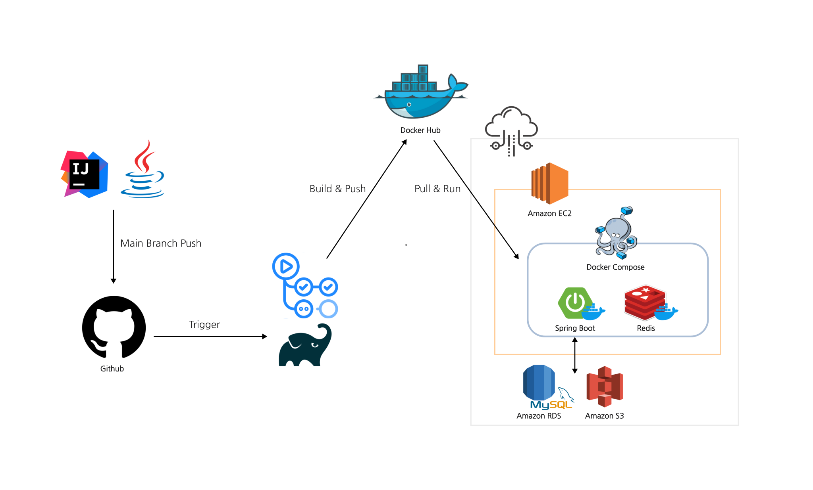

# TrustCrews
<br>

## 💼 서비스 소개
- 신뢰기반 프로젝트 매칭 플랫폼
- 사용자들의 신뢰등급을 바탕으로 적합한 프로젝트와 팀원을 연결해주는 혁신적인 서비스
- 신뢰등급을 통해 자신에게 맞는 프로젝트에 구직 신청을 하거나 팀원을 모집
- 프로젝트 등급에 준하는 사용자들만 프로젝트에 참여할 수 있어 부정적인 이탈 및 다양한 이슈등을 방지하고 사용자들끼리의 협업을 촉진해 프로젝트의 성공 확률을 높이고자 합니다.
<br >
<br >

## 🗓️ 개발 기간

```jsx
2023.11.01 ~ 24.01.10
```

<br >
<br >

## 💻 핵심 기능

<br>
<br>

## 📚 기술 스택
<div align="center">
  
  
   
  
</div>
<div align="center">
  
  
</div>
<div align="center">
  
  
  
</div>
<div align="center">
  
</div>
<div align="center">
  
</div>

<br>
<br>

## 🚀 서버 아키텍처
<div>
  
</div>
